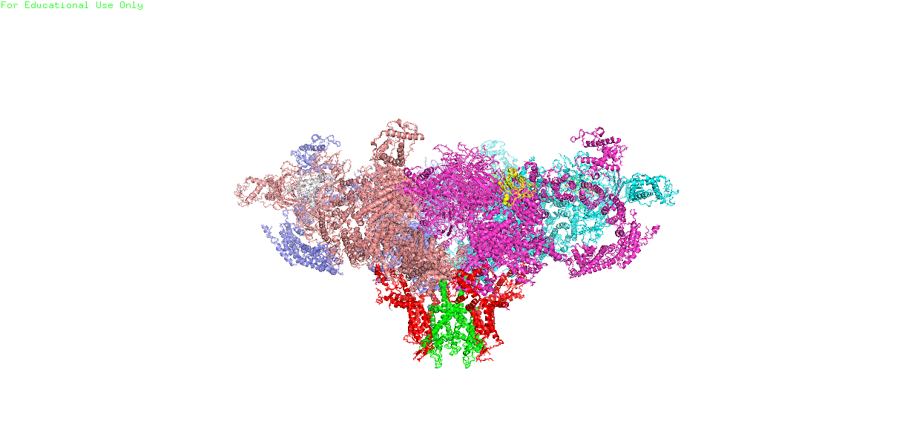

# Domains of ryr1 
[pymol](https://pymol.org/2/#download) was used for the images
The ryr1 is a large protein made out of 8 chains. symmetry were imposed on the system
 
**Figure 1:** type-1 ryanodine receptor

## The channel pore domain
The channel pore domain 
