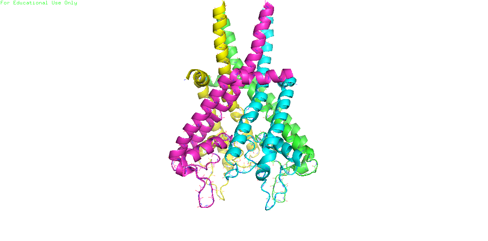

# Domains of ryr1 
[pymol](https://pymol.org/2/#download) was used for the images
The ryr1 is a large protein made out of 8 chains. symmetry were imposed on the system
 
**Figure 1:** type-1 ryanodine receptor

## The channel pore domain

**Figure 2:** The channel pore domain composed of helices S5 and S6 of the six-transmembrane (6TM) cation channel family. A pseudo- voltage-sensor domain (pVSD) spanning helices S1–S4 is linked via a short amphipathic helix to the pore domain, composed of helices S5 and S6.   
